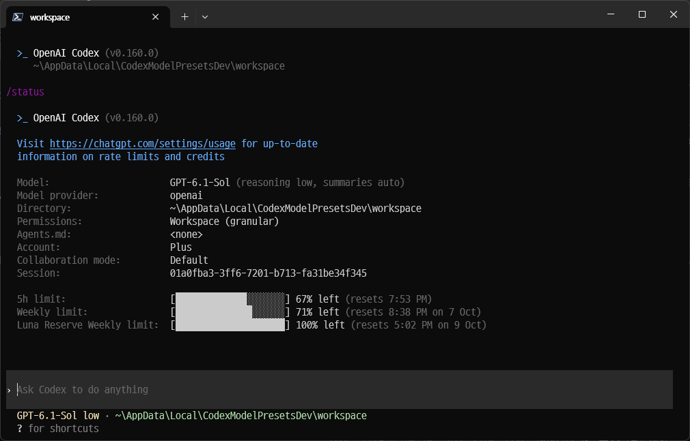

# Codex CLI: Model & Reasoning Presets

[English](README.md) | [한국어](README.ko.md)

An unofficial fork of [openai/codex](https://github.com/openai/codex) experimenting with keyboard shortcuts that switch the model and reasoning effort together in the TUI.



Switch presets with keyboard shortcuts and use `/status` to check the selected model and effort.

Related issue: [Model + Reasoning presets/profiles #44603](https://github.com/openai/codex/issues/44603). The issue targets the desktop app; this fork explores the implementation and behavior in the CLI/TUI. The goal is to share the implementation and test results in the issue's design discussion.

**Current status:** Presets are implemented, and automated tests, a Windows build, and shortcut switching in an actual terminal have been checked. Ctrl+1, Ctrl+2, and Ctrl+3 switching and preservation of saved defaults after session and terminal restarts have been verified.

## Preset configuration and behavior

Define named combinations of model and reasoning effort, then switch both with a keyboard shortcut in the current conversation.

```toml
[tui.model_presets.sol]
model = "gpt-6.1-sol"
reasoning_effort = "xhigh"
key = "ctrl-1"

[tui.model_presets.astra]
model = "gpt-6-astra"
reasoning_effort = "high"
key = "ctrl-2"
```

Add the configuration to `config.toml` and restart the TUI. The development script uses `%LOCALAPPDATA%\CodexModelPresetsDev\home\config.toml`. Use model and effort combinations supported by the model catalog available in your environment.

Add more presets using the same `[tui.model_presets.<name>]` format.

- A selection applies only to the current conversation and does not change the saved default model or effort.
- The conversation and draft text are preserved. The new settings apply starting with the next turn.
- In Plan mode, the model changes for the current conversation, while the effort applies to the Plan mode settings.
- Shortcuts are configurable, with conflict checks against existing bindings and other presets.

Default mode and Plan mode manage effort separately. For example, if Default mode uses `medium` and you select a `high` preset in Plan mode, Plan uses `high` while Default keeps `medium`. When clearing a temporary Ultra selection in the session, the existing session selection path may also update the effort for the other mode.

`ultra` is a reasoning effort value. Ultra presets cannot currently be applied through a shortcut. If the model supports Ultra, select it directly in the advanced reasoning picker under `/model`.

A preset's `key` currently supports a single key combination. Multi-key sequences (chords) are rejected, as are presets that conflict with the first key of an existing chord. Keys used for ordinary text input or AltGr input cannot be assigned.

## Known limitations

- Conflict detection misses some aliases of fixed shortcuts, including `alt-v` and `ctrl-shift-d`. Assigning these to presets can conflict with existing paste or quit behavior, or produce different behavior depending on the active screen.
- In Vim insert mode on Unix terminals without enhanced keyboard reporting, an Alt preset can be interpreted as `Esc` followed by a character. For example, `alt-x` can delete a character from the draft instead of switching presets. This was identified by tracing the source; it has not been verified by running the TUI on Unix.

Ctrl+number shortcuts require the terminal to forward the corresponding key events. If the terminal intercepts them or does not distinguish them, try a different combination in `key`.

## Implementation

The switching path is `shortcut → preset validation → SelectSessionModel → existing session settings update`.

- Preset definitions are added to the [TUI configuration](codex-rs/config/src/types.rs) and passed through the existing local settings loading path.
- The existing key specification parser, TUI bindings, and conflict checks are reused.
- Input guards follow the existing [reasoning shortcuts](codex-rs/tui/src/chatwidget/reasoning_shortcuts.rs), including popup and modal ownership, startup readiness, parent-agent input ownership, and clearing the quit shortcut hint after handling a shortcut.
- The target model and supported effort are checked before dispatching to the existing [SelectSessionModel handler](codex-rs/tui/src/app/model_defaults.rs). No separate model switching or default persistence path is introduced.
- Unsupported combinations produce a message without substituting another model or effort.

## Progress

- [x] Review existing model selection, reasoning shortcuts, configuration, and tests
- [x] Add preset configuration types and loading — verify TOML parsing and compatibility with existing configuration
- [x] Update the configuration schema and check the generated output
- [x] Connect key bindings and conflict checks — verify invalid keys, duplicates, existing bindings, and chord prefix conflicts
- [x] Connect preset shortcuts to session selection — validate input guards, models, and efforts
- [x] Add and run regression tests — verify session scope, preservation of defaults, Plan mode, and draft preservation while a task is running
- [x] Verify Ctrl+1, Ctrl+2, and Ctrl+3 in an actual terminal, and preservation of defaults after session and terminal restarts

## Validation

| Area | What to check |
| --- | --- |
| Configuration | Existing behavior without presets, valid TOML parsing, and invalid configuration diagnostics |
| Keyboard input | Key normalization and conflict checks, popup/modal and input ownership guards, and draft preservation |
| Model selection | Switching to supported combinations, rejecting unsupported combinations, and preserving existing reasoning restrictions |
| Session scope | Only the current conversation changes; other conversations, new-conversation defaults, and `config.toml` remain unchanged |
| Mode and timing | Default/Plan scope, preservation of the running turn, and applying changes to the next turn |
| Terminal | Actual Ctrl+number event delivery and switching results |

The [session selection tests](codex-rs/tui/src/app/tests/model_defaults_tests.rs) use the embedded app-server to verify changes to the current conversation in Default/Plan mode, preservation of defaults for other and new conversations, and unchanged `config.toml` contents. Model changes follow the existing `SelectSessionModel` contract: they apply to the next turn. Switching during an actual streaming request is not covered by the automated tests in this experiment.

Run the preset tests from the `codex-rs` directory in a Visual Studio Developer PowerShell (x64). The embedded server tests on Windows use the 8 MiB stack setting from the repository's CI.

```powershell
$env:RUSTUP_AUTO_INSTALL = "0"
$env:RUST_MIN_STACK = "8388608"
cargo test --locked -p codex-config --lib model_presets --target x86_64-pc-windows-msvc
cargo test --locked -p codex-tui --lib model_presets --target x86_64-pc-windows-msvc -- --test-threads=1
```

Results recorded on 2026-10-02: implementation commit `9c3ce7c1d`, Rust `1.95.0`, Windows x64 MSVC.

| Check | Result |
| --- | --- |
| `codex-config` `model_presets` tests | 3 passed |
| `codex-tui` `model_presets` tests | 12 passed |
| Existing `keymap::` tests | 132 passed, including preset key tests |
| Existing `session_model_selection` tests | 4 passed |
| Existing `reasoning_` tests | 116 passed; 2 snapshot tests failed due to a version display difference |
| Configuration schema | Updated with the generator; required preset fields and references checked |
| `cargo build --locked -p codex-cli --bin codex --target x86_64-pc-windows-msvc` | Passed |
| Development script startup with `-NoBuild` | Reached the login screen with two presets in a temporary configuration |
| Actual terminal shortcuts (manual verification by the author) | Verified Ctrl+1, Ctrl+2, and Ctrl+3 for an additional preset |
| Session and terminal restarts (manual verification by the author) | Verified that saved defaults were preserved after restarting sessions and the terminal |

Both failed snapshot comparisons were caused by the version string in the `/status` output: the expected value was `v0.0.0`, while the actual value was `v0.160.0`. The rest of the compared output, including the model and effort, was identical.

Ctrl+1/2 key events and session settings updates were verified by automated tests. The author manually verified Ctrl+1, Ctrl+2, and Ctrl+3 switching in an actual terminal, along with preservation of defaults after session and terminal restarts.

See [Installing & building](docs/install.md) for build instructions and [rust-toolchain.toml](codex-rs/rust-toolchain.toml) for the pinned toolchain.

## Build and try it (Windows x64)

Build and launch from the repository root using the [development script](scripts/dev-model-presets.ps1).

```powershell
# Build incrementally and launch from the repository root
powershell -File .\scripts\dev-model-presets.ps1

# Launch the existing binary
powershell -File .\scripts\dev-model-presets.ps1 -NoBuild
```

Use `pwsh` instead of `powershell` for PowerShell 7. The script builds the `codex` binary and launches it with `--no-daemon`.

Configuration, authentication, and conversation history use `%LOCALAPPDATA%\CodexModelPresetsDev\home`. The working directory is the adjacent `workspace` directory.

1. Add the preset configuration above to the development `home\config.toml` and restart with `-NoBuild`.
2. In an authenticated conversation, run `/status` → Ctrl+1 → `/status` → Ctrl+2 → `/status` to check the model and effort.
3. Add another named preset with `key = "ctrl-3"`, restart, and verify that the additional preset switches correctly.
4. Check that draft text is preserved and that presets also apply in Plan mode.
5. After session and terminal restarts, check that the saved defaults are used and that `config.toml` has not changed.

Testing Code Mode or Windows sandbox tool execution requires building the corresponding helper binaries as well.

## Upstream project

- [OpenAI Codex](https://github.com/openai/codex) · [Official documentation](https://developers.openai.com/codex)
